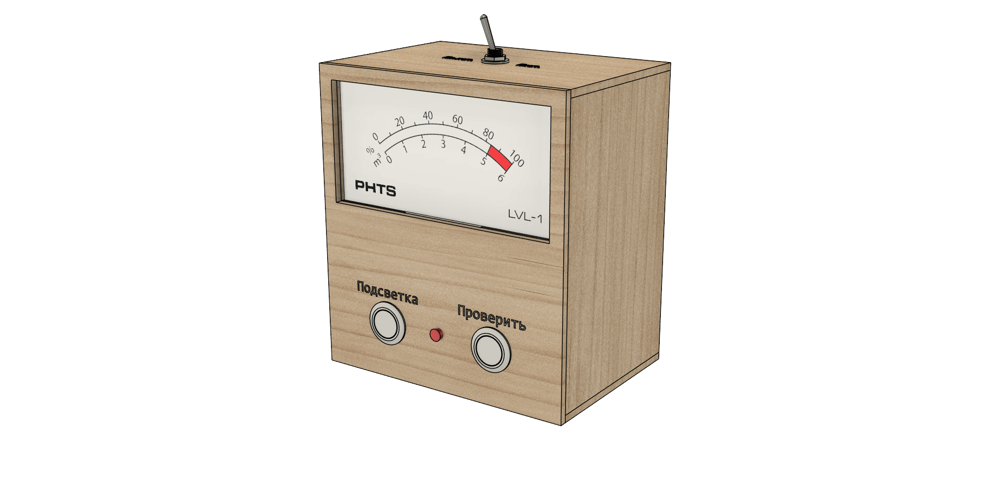
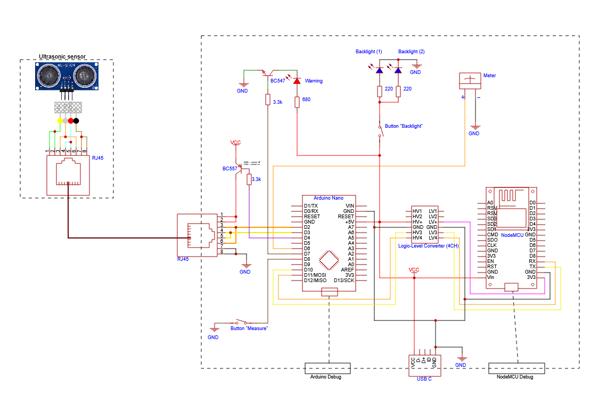
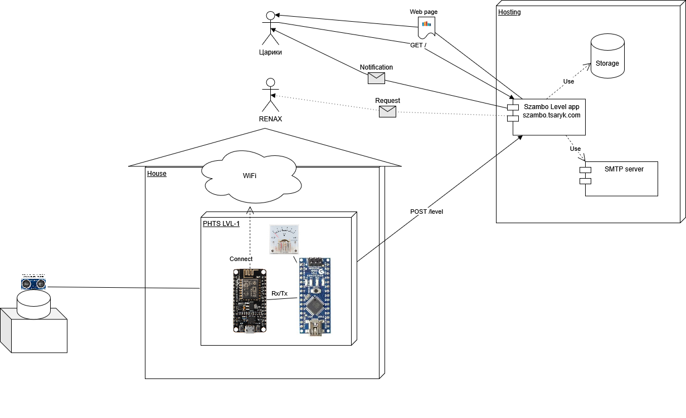

# PHTS LVL-1

Features:

- Use ultrasonic sensor to measure distance
- Show level on the big fancy indicator
- Send levels and logs to [szambo.tsaryk.com] via WiFi
- 24/7 monitoring

## Firmware

Consists of 2 modules: [Arduino Nano](./arduino) and [NodeMCU V3](./nodemcu).

## Design

### Schematic diagram

Hosted on: [OSHWLab/phts/lvl-1](https://oshwlab.com/phts/lvl-1).

### Deployment diagram

[szambo.tsaryk.com]: https://github.com/phts/szambo.tsaryk.com

## Usage

### Indication

| State       | LED                               | Meter                            | Description                                                          |
| ----------- | --------------------------------- | -------------------------------- | -------------------------------------------------------------------- |
| Starting up | `*______*______` (slow blinking)  | Progress bar (number on `%` bar) | The device is starting up                                            |
| Normal      | `______________` (constantly off) | Actual level                     | Normally operational device                                          |
| Warning     | `**************` (constantly on)  | Actual level                     | Level is reaching the maximum                                        |
| Failure     | `*_*_*_*_*_*_*_` (fast blinking)  | Error code (number on `m³` bar)  | Operation failure. See the error code description in the table below |

#### Errors

| Code | Type      | Description                          |
| ---- | --------- | ------------------------------------ |
| 1    | Fatal     | Ultrasonic sensor failure            |
| 2    | Temporary | NodeMCU module communication failure |
| 3    | Temporary | WiFi connection failure              |
| 4    | Temporary | Unexpected HTTP response             |

- `Fatal` &mdash; will be indicated constantly until the failure is gone
- `Temporary` &mdash; will be hidden after 1 minute and back to a normal state
